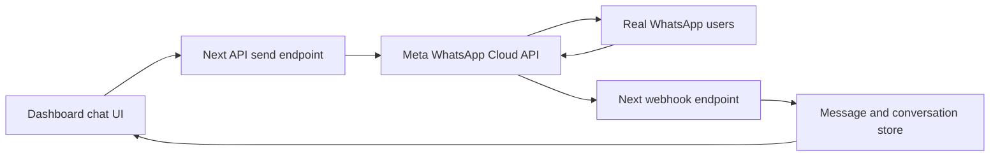

# WhatsApp Cloud API Integration Plan for Dashboard Chat UI

## 1. Objective

Connect the existing dashboard WhatsApp-like frontend widget to real WhatsApp users through the official Meta WhatsApp Cloud API.

Scope for first production release:

- Two-way text messaging
- Two-way image messaging
- Two-way PDF document messaging
- Secure webhook handling
- Production deployment on Vercel with Next.js backend routes

Out of scope for first release:

- Audio and video messaging
- Multi-agent assignment automation
- Campaign orchestration and marketing workflows

---

## 2. Current State Assessment

The current chat UI is mock-only with in-memory sample conversations and simulated replies.

Observed characteristics:

- Frontend widget exists and is already integrated into dashboard shell
- Messages are not persisted in a database
- No backend API route exists for WhatsApp send or webhook receive
- No WhatsApp Cloud API credentials or account setup exists yet

---

## 3. Recommended Production Architecture

Use direct Meta WhatsApp Cloud API with your existing Next.js app deployed on Vercel.

Architecture components:

1. Dashboard UI
   - Existing chat interface remains primary operator UI
   - Replace mock state with server-backed conversation and message data

2. Next.js backend API routes
   - Send message endpoint for text and media
   - Webhook verification and inbound event receiver
   - Media upload helper endpoint for image and PDF sending

3. Meta WhatsApp Cloud API
   - Official Graph API for message send and media operations
   - Webhook delivery for inbound messages and delivery/read statuses

4. Persistent data storage
   - Production database for contacts, conversations, messages, statuses
   - Optional object storage for mirrored media copies

5. Operations and security
   - Env-secrets on Vercel
   - Signature verification for webhook requests
   - Structured logs and failure tracing

---

## 4. Account and Platform Onboarding Runbook from Zero

You need to complete these business-side steps before coding can fully work in production.

### A. Meta Business foundation

1. Create Meta Business Manager account
2. Enable two-factor authentication for admin users
3. Complete business verification in Meta
4. Add legal business details consistent with documents

### B. Meta developer setup

1. Create Meta Developer account
2. Create a new Meta app
3. Add WhatsApp product to the app
4. Link app to Business Manager

### C. WhatsApp Business setup

1. Create WhatsApp Business Account in Meta
2. Register your new dedicated phone number
3. Configure display name and business profile
4. Verify phone number by SMS or voice OTP

### D. Production readiness requirements

1. Configure payment method in Meta billing
2. Generate system user and long-lived access token
3. Grant required permissions for WhatsApp management
4. Configure webhook callback URL and verify token

### E. Messaging policy readiness

1. Understand the 24-hour customer service window
2. Create and submit message templates for business-initiated outreach
3. Ensure user opt-in collection and storage process
4. Define opt-out handling and consent auditability

---

## 5. Target Data Model

Minimum entities:

- Contact
  - phone in E.164 format
  - display name
  - consent status
- Conversation
  - contact reference
  - channel type whatsapp
  - last message metadata
- Message
  - direction inbound or outbound
  - type text image document
  - text body
  - media id and mime metadata
  - external message id from Meta
  - status queued sent delivered read failed
- WebhookEventLog
  - raw payload
  - signature validation status
  - processing status and error details

Database recommendation:

- Use PostgreSQL for reliable querying and auditability
- Add indexed lookup by phone number and Meta message id

---

## 6. API and Backend Design in Next.js

Planned API route structure:

- `/api/whatsapp/webhook`
  - `GET` verify webhook token challenge
  - `POST` receive inbound messages and status updates
- `/api/whatsapp/messages`
  - `POST` send text message
  - `POST` send media message with uploaded media id
- `/api/whatsapp/media`
  - `POST` upload image or PDF to Cloud API media endpoint

Backend service responsibilities:

1. Validate input payloads with strict schema
2. Normalize phone numbers to E.164
3. Route outbound message type text image document
4. Persist request and response audit data
5. Parse webhook events and upsert message statuses
6. Handle retries for transient API failures

---

## 7. Message Flow Design for Text, Images, and PDF

### Outbound text

1. Agent composes text in dashboard
2. Frontend calls send endpoint
3. Backend calls Cloud API messages endpoint
4. Save outbound message with Meta message id
5. Update status via subsequent webhook events

### Outbound image or PDF

1. Agent selects file in dashboard
2. Backend validates type and size
3. Backend uploads media to Cloud API and gets media id
4. Backend sends document or image message using media id
5. Save metadata and map to conversation thread

### Inbound text or media

1. User sends message in WhatsApp app
2. Cloud API webhook posts event to Next webhook route
3. Backend verifies signature and parses event
4. Save message record and media metadata
5. Frontend fetches or subscribes to latest conversation updates

### Media retrieval behavior

- Store media id and metadata
- Retrieve download URL from Cloud API when needed
- Optionally mirror to secure storage for long-term retention policy

---

## 8. Security, Compliance, and Reliability Controls

Security baseline:

1. Store all secrets in Vercel project environment variables only
2. Verify webhook signature with app secret
3. Enforce server-side authorization for dashboard operators
4. Validate all uploads and reject unsupported mime types
5. Sanitize and limit user-provided text content
6. Add API rate limits and abuse protections

Compliance and policy controls:

1. Keep explicit user consent records for outbound initiation
2. Respect template-only rule outside the 24-hour service window
3. Implement opt-out keywords and suppression logic
4. Maintain message audit logs and change history

Reliability controls:

1. Idempotent webhook processing by event id or message id
2. Retry with backoff for temporary failures
3. Dead-letter capture for failed event processing
4. Monitoring alerts for webhook verification failures and send failures

---

## 9. Vercel Environment Variables and Secrets

Required environment variables:

- `WHATSAPP_ACCESS_TOKEN`
- `WHATSAPP_PHONE_NUMBER_ID`
- `WHATSAPP_BUSINESS_ACCOUNT_ID`
- `WHATSAPP_VERIFY_TOKEN`
- `META_APP_SECRET`
- `WHATSAPP_API_VERSION`
- `DATABASE_URL`

Operational recommendation:

- Use separate dev and prod Meta app credentials
- Rotate tokens on a policy schedule
- Restrict admin access to Vercel project settings

---

## 10. Phased Rollout Plan

### Phase 1: Platform setup

- Complete Meta Business, Developer, and WhatsApp onboarding
- Prepare production phone number and business profile
- Configure billing and permissions

### Phase 2: Backend foundation

- Add webhook route verify and receive handlers
- Add send text route and media upload route
- Integrate Cloud API service layer and error mapping

### Phase 3: Data persistence

- Introduce production database schema
- Persist contacts, conversations, messages, statuses, webhook logs
- Add migration scripts and seed for local testing

### Phase 4: Frontend integration

- Replace mock data in chat widget with backend APIs
- Add file picker support for image and PDF uploads
- Add send states and delivery status indicators

### Phase 5: QA and policy validation

- End-to-end tests for inbound and outbound flows
- Validate 24-hour window behavior and template fallback
- Security and webhook signature verification testing

### Phase 6: Production launch

- Configure production webhook callback in Meta
- Run smoke tests with real numbers
- Enable monitoring, alerts, and incident playbook

---

## 11. Explicit User-Side Action Checklist

You need to complete these actions directly in Meta and business settings:

1. Create and verify Meta Business account
2. Create Meta developer app and add WhatsApp product
3. Create WhatsApp Business Account and register new number
4. Set display name and business profile details
5. Add billing method for production messaging
6. Create system user and generate long-lived token
7. Provide required secrets for deployment environment
8. Confirm approved template strategy for business-initiated messages
9. Confirm customer opt-in collection process on your website and forms

---

## 12. Implementation-Ready Deliverables for Next Mode

When switching to implementation mode, deliver in this order:

1. API routes for webhook, send, and media
2. Cloud API client utility and schemas
3. Database models and message persistence
4. Frontend refactor from mock state to live API
5. File upload support for image and PDF
6. Status rendering sent delivered read failed
7. Documentation and environment setup guide

This plan is aligned to your chosen stack: Next.js + Vercel + official Meta WhatsApp Cloud API + new dedicated number.
